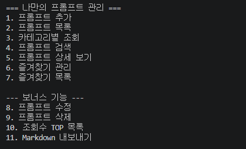
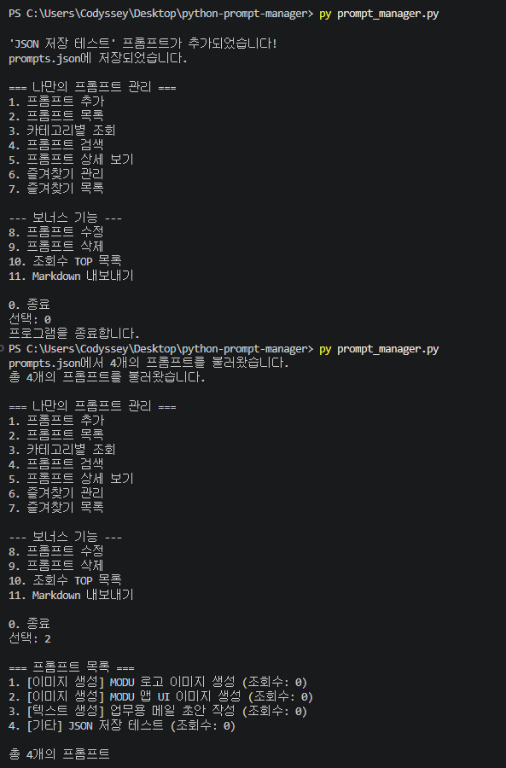
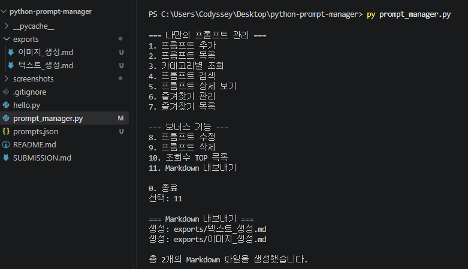
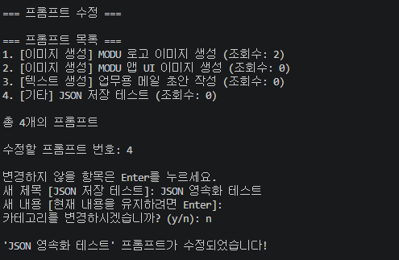
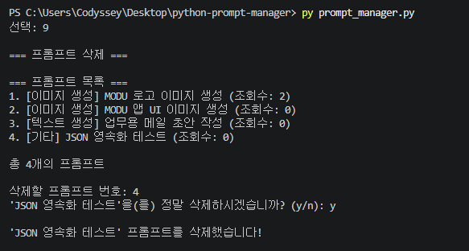
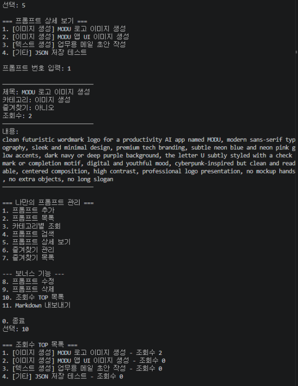
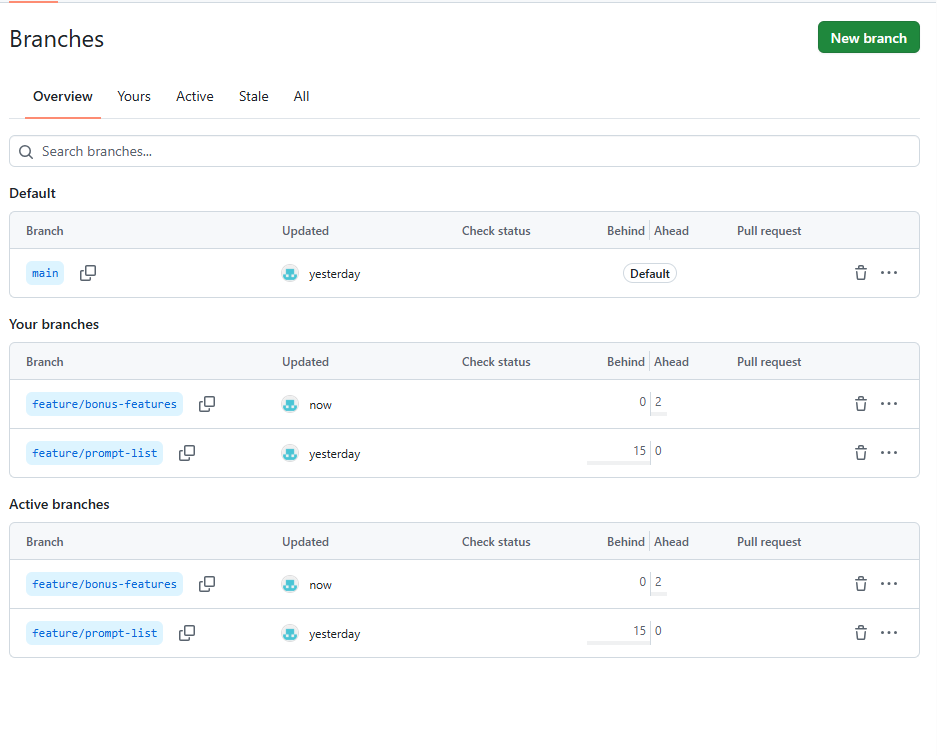

# Python Prompt Manager

Python 기본 문법과 Git/GitHub를 활용하여 만든 **콘솔 기반 프롬프트 관리 프로그램**입니다.

생성형 AI 미션에서 사용한 여러 프롬프트를 한곳에서 관리하기 위해 제작했습니다.

필수 기능뿐 아니라 보너스 과제로 **JSON 영속화, Markdown 내보내기, 프롬프트 수정·삭제, 조회수 기록 및 조회수 TOP 목록**까지 구현했습니다.

---

## 최종 제출 문서

과제의 전체 구현 내용, 개발 과정, Git/GitHub 사용 기록 및 실행 증빙은 아래 문서에서 확인할 수 있습니다.

➡️ **[SUBMISSION.md 바로가기](SUBMISSION.md)**

---

# GitHub Repository

https://github.com/ll-0l/python-prompt-manager

저장소 공개 범위: **Public**

---

# 개발 환경

* 운영체제: Windows
* 개발 도구: Visual Studio Code
* Python: 3.14.7
* Python 요구 버전: 3.10 이상
* Git: 2.55.0.windows.3
* 버전 관리: Git / GitHub
* 외부 Python 라이브러리: 사용하지 않음

Python 버전 확인:

```bash
py --version
```

환경에 따라:

```bash
python -V
```

Git 버전 확인:

```bash
git --version
```


---

# 실행 방법

## 1. 저장소 Clone

```bash
git clone https://github.com/ll-0l/python-prompt-manager.git
```

## 2. 프로젝트 폴더 이동

```bash
cd python-prompt-manager
```

## 3. 프로그램 실행

Windows:

```bash
py prompt_manager.py
```

환경에 따라:

```bash
python prompt_manager.py
```

를 사용할 수도 있습니다.

---

# 프로그램 메뉴

```text
=== 나만의 프롬프트 관리 ===
1. 프롬프트 추가
2. 프롬프트 목록
3. 카테고리별 조회
4. 프롬프트 검색
5. 프롬프트 상세 보기
6. 즐겨찾기 관리
7. 즐겨찾기 목록

--- 보너스 기능 ---
8. 프롬프트 수정
9. 프롬프트 삭제
10. 조회수 TOP 목록
11. Markdown 내보내기

0. 종료
선택:
```



---

# 필수 기능

## 1. 프롬프트 추가

새로운 프롬프트를 등록할 수 있습니다.

입력 항목:

* 제목
* 내용
* 카테고리

제목이나 내용이 비어 있으면 다시 입력하도록 처리합니다.

새로운 프롬프트의 기본 구조:

```python
{
    "title": "프롬프트 제목",
    "content": "프롬프트 내용",
    "category": "텍스트 생성",
    "favorite": False,
    "view_count": 0
}
```

프롬프트가 추가되면 `prompts.json`에도 자동 저장됩니다.

---

## 2. 프롬프트 목록

현재 등록되어 있는 모든 프롬프트를 출력합니다.

표시 정보:

* 번호
* 카테고리
* 제목
* 즐겨찾기 여부
* 조회수

예:

```text
1. [이미지 생성] MODU 로고 이미지 생성 (조회수: 2)
2. [이미지 생성] MODU 앱 UI 이미지 생성 (조회수: 0)
3. [텍스트 생성] 업무용 메일 초안 작성 (조회수: 0)
```

---

## 3. 카테고리별 조회

사용자가 선택한 카테고리에 해당하는 프롬프트만 필터링하여 출력합니다.

핵심 조건:

```python
prompt["category"] == selected_category
```

기본 카테고리는 다음과 같습니다.

1. 텍스트 생성
2. 이미지 생성
3. 영상 생성
4. 페르소나
5. 자동화
6. 기타

사용자가 직접 새로운 카테고리를 입력할 수도 있습니다.

---

## 4. 프롬프트 검색

검색어가 프롬프트의 제목 또는 내용에 포함되어 있는지 확인합니다.

핵심 로직:

```python
keyword.lower() in prompt["title"].lower()
```

```python
keyword.lower() in prompt["content"].lower()
```

영문 문자열의 경우 대소문자의 영향을 줄이기 위해 `lower()`를 사용합니다.

현재 방식은 **부분 문자열 검색**입니다.

지원하지 않는 고급 검색:

* 정규표현식
* 검색 관련도 순위
* AND / OR 복합 검색
* 정확 일치 전용 검색

---

## 5. 프롬프트 상세 보기

사용자가 프롬프트 번호를 선택하면 다음 정보를 출력합니다.

* 제목
* 카테고리
* 즐겨찾기 상태
* 조회수
* 전체 프롬프트 내용

보너스 기능 구현 이후에는 **상세 보기를 할 때마다 조회수가 1 증가**합니다.

---

## 6. 즐겨찾기 관리

즐겨찾기 상태는 다음 방식으로 토글합니다.

```python
prompt["favorite"] = not prompt["favorite"]
```

즉:

```text
False → True
True → False
```

로 변경됩니다.

즐겨찾기 변경 결과 역시 `prompts.json`에 자동 저장됩니다.

---

## 7. 즐겨찾기 목록

`favorite` 값이 `True`인 프롬프트만 별도로 출력합니다.

즐겨찾기가 없는 경우 안내 메시지를 출력합니다.

---

# 기본 프롬프트 데이터

프로그램 최초 실행 시 다음 기본 프롬프트 3개를 제공합니다.

## 1. MODU 로고 이미지 생성

* 카테고리: 이미지 생성

## 2. MODU 앱 UI 이미지 생성

* 카테고리: 이미지 생성

## 3. 업무용 메일 초안 작성

* 카테고리: 텍스트 생성

`prompts.json`이 존재하지 않는 최초 실행에서는 기본 프롬프트를 이용해 JSON 파일을 생성합니다.

---

# 데이터 구조

여러 프롬프트는 Python **리스트(List)** 로 관리하고, 각 프롬프트는 **딕셔너리(Dictionary)** 로 표현합니다.

```python
prompts = [
    {
        "title": "MODU 로고 이미지 생성",
        "content": "프롬프트 내용",
        "category": "이미지 생성",
        "favorite": False,
        "view_count": 0
    }
]
```

## 데이터 스키마

| 필드           | 자료형    | 설명        |
| ------------ | ------ | --------- |
| `title`      | `str`  | 프롬프트 제목   |
| `content`    | `str`  | 프롬프트 내용   |
| `category`   | `str`  | 카테고리      |
| `favorite`   | `bool` | 즐겨찾기 상태   |
| `view_count` | `int`  | 상세 보기 조회수 |

---

# 리스트와 딕셔너리를 선택한 이유

## 리스트

여러 프롬프트를 등록 순서대로 저장하고 반복문으로 쉽게 조회하기 위해 사용했습니다.

새로운 데이터를 추가할 때:

```python
prompts.append(new_prompt)
```

처럼 처리할 수 있습니다.

### 장점

* 순서 유지가 쉬움
* 전체 반복이 쉬움
* 데이터 추가가 간단함
* 소규모 콘솔 프로그램에 적합함

### 한계

검색이나 중복 확인 시 리스트 전체를 순차적으로 검사하기 때문에 데이터가 매우 많아지면 성능이 떨어질 수 있습니다.

---

## 딕셔너리

프롬프트 하나가 여러 속성을 가지고 있기 때문에 딕셔너리를 사용했습니다.

```python
prompt["title"]
prompt["content"]
prompt["category"]
prompt["favorite"]
prompt["view_count"]
```

### 장점

* 각 데이터의 의미가 명확함
* 코드 가독성이 좋음
* 새로운 속성을 추가하기 쉬움

데이터 규모가 매우 커질 경우 고유 ID와 SQLite 등의 데이터베이스를 사용하는 방법으로 확장할 수 있습니다.

---

# 중복 제목 처리

동일한 제목이 이미 존재하면 기존 데이터를 덮어쓰지 않습니다.

자동으로 번호를 추가합니다.

```text
MODU 로고 이미지 생성
MODU 로고 이미지 생성 (2)
MODU 로고 이미지 생성 (3)
```

이를 통해 동일 제목의 데이터를 각각 보존할 수 있습니다.

---

# 카테고리 충돌 처리

직접 입력한 카테고리가 기존 카테고리와 동일하면 새로 중복 생성하지 않고 기존 카테고리를 사용합니다.

영문 카테고리 비교에서는 대소문자를 무시합니다.

예:

```text
Image
image
IMAGE
```

를 비교하여 기존 카테고리를 재사용할 수 있습니다.

---

# 보너스 과제 1 — JSON 영속화

## JSON 저장

보너스 기능으로 프롬프트 데이터를 다음 파일에 저장합니다.

```text
prompts.json
```

Python 기본 라이브러리인 `json`을 사용합니다.

예:

```json
[
    {
        "title": "MODU 로고 이미지 생성",
        "content": "프롬프트 내용",
        "category": "이미지 생성",
        "favorite": false,
        "view_count": 2
    }
]
```

프롬프트가 변경되면 `save_prompts()` 함수가 실행됩니다.

저장되는 경우:

* 새 프롬프트 추가
* 프롬프트 수정
* 프롬프트 삭제
* 즐겨찾기 변경
* 상세 보기 조회수 증가

---

## JSON 불러오기

프로그램 시작 시 `load_prompts()`가 실행됩니다.

```text
프로그램 실행
↓
prompts.json 존재 여부 확인
↓
있음 → 기존 데이터 불러오기
없음 → 기본 프롬프트 3개 생성
↓
프로그램 사용
```

따라서 **프로그램을 종료한 후 다시 실행해도 데이터가 유지됩니다.**



---

## JSON 오류 처리

`prompts.json`을 읽는 과정에서 문제가 발생할 경우 예외를 처리하도록 구성했습니다.

처리 대상:

* 파일 읽기 오류
* JSON 형식 오류
* 예상하지 않은 데이터 구조

오류가 발생하면 기본 프롬프트 데이터로 프로그램을 시작할 수 있도록 설계했습니다.

---

# 보너스 과제 1 — Markdown 내보내기

메뉴 `11`을 선택하면 전체 프롬프트를 **카테고리별 Markdown 파일**로 내보냅니다.

예:

```text
exports/
├── 이미지_생성.md
├── 텍스트_생성.md
└── 기타.md
```

카테고리에 실제 프롬프트가 존재하는 경우에만 해당 Markdown 파일을 생성합니다.

각 Markdown 파일에는 다음 정보가 포함됩니다.

* 제목
* 카테고리
* 즐겨찾기
* 조회수
* 프롬프트 내용



---

# 보너스 과제 2 — 프롬프트 수정

메뉴:

```text
8. 프롬프트 수정
```

사용자는 기존 프롬프트의 다음 정보를 변경할 수 있습니다.

* 제목
* 내용
* 카테고리

변경하지 않을 항목은 Enter를 눌러 기존 값을 유지할 수 있습니다.

수정한 제목이 기존 제목과 충돌할 경우 중복 제목 처리 규칙을 적용합니다.

수정 후 결과는 `prompts.json`에 저장됩니다.



---

# 보너스 과제 2 — 프롬프트 삭제

메뉴:

```text
9. 프롬프트 삭제
```

삭제할 프롬프트 번호를 선택한 후 실제 삭제 전에 확인을 요청합니다.

```text
정말 삭제하시겠습니까? (y/n):
```

`y`를 입력한 경우에만 데이터를 삭제합니다.

삭제 후 `prompts.json`에도 변경 결과를 저장합니다.



---

# 보너스 과제 2 — 조회수 기록

프롬프트 상세 보기를 실행하면 해당 프롬프트의 조회수를 1 증가시킵니다.

```python
prompt["view_count"] += 1
```

변경된 조회수는 JSON 파일에 저장되므로 프로그램을 종료해도 유지됩니다.

---

# 보너스 과제 2 — 조회수 TOP 목록

메뉴:

```text
10. 조회수 TOP 목록
```

프롬프트를 조회수가 높은 순서로 정렬합니다.

핵심 로직:

```python
sorted(
    prompts,
    key=lambda prompt: prompt["view_count"],
    reverse=True
)
```



---

# 함수 구조

기능별로 함수를 분리했습니다.

| 함수                     | 역할                  |
| ---------------------- | ------------------- |
| `save_prompts()`       | JSON 저장             |
| `load_prompts()`       | JSON 불러오기           |
| `get_categories()`     | 현재 카테고리 목록 생성       |
| `make_unique_title()`  | 중복 제목 처리            |
| `select_category()`    | 카테고리 선택 및 직접 입력     |
| `add_prompt()`         | 프롬프트 추가             |
| `show_prompt_list()`   | 전체 목록 출력            |
| `show_by_category()`   | 카테고리별 조회            |
| `search_prompt()`      | 제목·내용 검색            |
| `show_prompt_detail()` | 상세 보기 및 조회수 증가      |
| `toggle_favorite()`    | 즐겨찾기 추가·해제          |
| `show_favorites()`     | 즐겨찾기 목록             |
| `edit_prompt()`        | 프롬프트 수정             |
| `delete_prompt()`      | 프롬프트 삭제             |
| `show_top_prompts()`   | 조회수 기준 정렬           |
| `safe_filename()`      | Markdown 파일명 안전 처리  |
| `export_markdown()`    | 카테고리별 Markdown 내보내기 |
| `show_menu()`          | 메뉴 출력               |
| `main()`               | 프로그램 전체 실행          |

---

# 입력 검증

사용자가 잘못된 값을 입력해도 프로그램이 갑자기 종료되지 않도록 검증합니다.

처리 대상:

* 메인 메뉴 잘못된 번호
* 빈 제목
* 빈 내용
* 빈 카테고리
* 카테고리 번호 오류
* 빈 검색어
* 상세 보기 문자 입력
* 존재하지 않는 번호
* 수정 번호 오류
* 삭제 번호 오류
* 삭제 취소

현재는 각 함수에서 직접 검증하며, 규모가 더 커질 경우 공통 검증 함수로 리팩토링할 수 있습니다.

---

# 메인 반복 구조

프로그램은 사용자가 명시적으로 종료할 때까지 계속 메뉴를 표시합니다.

```python
while True:
    show_menu()
    choice = input("선택: ").strip()
```

종료:

```python
if choice == "0":
    print("프로그램을 종료합니다.")
    break
```

---

# Git / GitHub 활용

이번 프로젝트에서 다음 Git 명령을 실제로 사용했습니다.

```text
git init
git add
git commit
git push
git pull
git checkout
git clone
git merge
```

---

# 프롬프트 목록 기능 브랜치

필수 과제의 프롬프트 목록 기능은 다음 브랜치에서 개발했습니다.

```text
feature/prompt-list
```

생성:

```bash
git checkout -b feature/prompt-list
```

기능 구현 후:

```bash
git checkout main
```

병합:

```bash
git merge --no-ff feature/prompt-list -m "merge: add prompt list feature"
```


---

# 보너스 기능 브랜치

필수 과제 100% 통과 버전의 `main`을 안전하게 보존하기 위해 보너스 기능은 별도 브랜치에서 개발했습니다.

브랜치:

```text
feature/bonus-features
```

생성:

```bash
git checkout -b feature/bonus-features
```

보너스 기능 구현 후 주요 커밋:

```text
feat: add bonus persistence and CRUD features
docs: add bonus feature screenshots
docs: add bonus branch screenshot
```

GitHub에도 해당 브랜치를 Push하여 별도의 개발 기록을 남겼습니다.



---

# Git Clone 실습

공개 GitHub 저장소를 실제로 Clone했습니다.

```bash
git clone https://github.com/octocat/Hello-World.git
```

이후:

```bash
cd Hello-World
dir
git log --oneline --graph --all
```

을 사용하여 파일 구조와 Git 로그를 확인했습니다.


---

# 주요 Commit

프로젝트는 기능 단위로 커밋했습니다.

예:

```text
chore: initialize project
feat: add default prompt data
feat: add main menu
feat: add prompt creation
feat: add prompt list
merge: add prompt list feature
feat: add category filter
feat: add prompt search
feat: add prompt detail view
feat: add favorite toggle
feat: add favorite list
docs: complete README
docs: add project screenshots
fix: handle duplicate prompt conflicts
docs: address design feedback in README
docs: address pre-evaluation feedback
feat: add bonus persistence and CRUD features
docs: add bonus feature screenshots
docs: add bonus branch screenshot
```

10개 이상의 의미 있는 커밋을 생성했습니다.

---

# 보너스 기능 증빙

| 증빙 파일                     | 내용                   |
| ------------------------- | -------------------- |
| `23_bonus_menu.png`       | 보너스 메뉴 추가            |
| `24_json_persistence.png` | JSON 저장 및 재실행 후 불러오기 |
| `25_bonus_edit.png`       | 프롬프트 수정              |
| `26_bonus_view_count.png` | 조회수 기록 및 TOP 목록      |
| `27_markdown_export.png`  | 카테고리별 Markdown 내보내기  |
| `28_bonus_delete.png`     | 프롬프트 삭제              |
| `29_bonus_branch.png`     | 보너스 기능 별도 Git 브랜치    |

---

# 프로젝트 구조

```text
python-prompt-manager/
│
├── exports/
│   ├── 이미지_생성.md
│   └── 텍스트_생성.md
│
├── screenshots/
│   ├── 01_Python_version.png
│   ├── 02_hello_execution.png
│   ├── ...
│   ├── 22_Final_Git_log.png
│   ├── 23_bonus_menu.png
│   ├── 24_json_persistence.png
│   ├── 25_bonus_edit.png
│   ├── 26_bonus_view_count.png
│   ├── 27_markdown_export.png
│   ├── 28_bonus_delete.png
│   └── 29_bonus_branch.png
│
├── .gitignore
├── README.md
├── SUBMISSION.md
├── hello.py
├── prompt_manager.py
└── prompts.json
```

`exports/`의 파일 수는 현재 등록된 프롬프트의 카테고리에 따라 달라질 수 있습니다.

---

# 데이터 저장 흐름

최종 버전의 데이터 흐름은 다음과 같습니다.

```text
프로그램 시작
↓
prompts.json 확인
↓
기존 JSON 데이터 불러오기
↓
프롬프트 관리
↓
추가 / 수정 / 삭제
즐겨찾기 변경 / 조회수 증가
↓
prompts.json 자동 저장
↓
프로그램 종료
↓
다음 실행에서도 기존 데이터 유지
```

---

# 필수 과제 완료 상태

* [x] Python 3.10 이상
* [x] 콘솔 메뉴
* [x] 기본 프롬프트 3개 이상
* [x] 리스트 / 딕셔너리 사용
* [x] 프롬프트 추가
* [x] 프롬프트 목록
* [x] 카테고리별 조회
* [x] 검색
* [x] 상세 보기
* [x] 즐겨찾기 추가·해제
* [x] 즐겨찾기 목록
* [x] 입력 검증
* [x] 함수 분리
* [x] Git 기능 단위 Commit
* [x] 10개 이상 Commit
* [x] 추가 Branch
* [x] Branch에서 기능 개발
* [x] main Merge 기록
* [x] Git Clone 실습
* [x] GitHub Public Repository
* [x] README.md
* [x] SUBMISSION.md

---

# 보너스 과제 완료 상태

## 보너스 1 — 프롬프트 영속화 및 내보내기

* [x] JSON 파일 저장
* [x] JSON 파일 불러오기
* [x] 프로그램 종료 후 데이터 유지
* [x] 카테고리별 Markdown 파일 내보내기

## 보너스 2 — CRUD 및 사용 기록

* [x] 프롬프트 수정
* [x] 프롬프트 삭제
* [x] 상세 보기 조회수 기록
* [x] 조회수 JSON 저장
* [x] 조회수 기준 TOP 목록

---

# 향후 개선 방향

현재 보너스 과제를 통해 JSON 영속화까지 구현했습니다.

더 확장한다면 다음 기능을 고려할 수 있습니다.

* SQLite 데이터베이스 적용
* 프롬프트 고유 ID
* 생성 날짜 / 수정 날짜
* 태그 기능
* 조회수 TOP 개수 선택
* 정확 검색 / 부분 검색 선택
* 복합 검색
* JSON 백업
* 삭제 복구 기능
* GUI
* 웹 기반 관리 시스템

데이터가 많아질 경우 다음과 같은 방식으로 확장할 수 있습니다.

```text
현재 JSON
↓
데이터 스키마 정리
↓
고유 ID 추가
↓
SQLite 테이블 생성
↓
JSON 데이터 마이그레이션
↓
데이터베이스 기반 검색/수정/삭제
```

---

# 프로젝트를 통해 학습한 내용

이번 프로젝트에서 다음 내용을 직접 사용했습니다.

* Python 파일 작성 및 실행
* 리스트
* 딕셔너리
* 조건문
* 반복문
* 함수
* 사용자 입력
* 검색과 필터링
* 정렬
* JSON 파일 저장 및 불러오기
* 파일 예외 처리
* Markdown 파일 자동 생성
* CRUD
* 조회수 기록
* Git 저장소 관리
* Commit
* Push / Pull
* Branch
* Merge
* Clone
* GitHub 저장소 관리

---

# 최종 제출

**프로젝트명:** Python Prompt Manager

**GitHub Repository:**
https://github.com/ll-0l/python-prompt-manager

**최종 제출 문서:**
[SUBMISSION.md](SUBMISSION.md)

**필수 과제:** 완료

**보너스 과제 1:** 완료

**보너스 과제 2:** 완료
