# Python Prompt Manager 최종 제출

## 1. 프로젝트 개요

생성형 AI 미션을 수행하면서 작성한 여러 프롬프트를 한곳에서 관리하기 위해 Python으로 **콘솔 기반 프롬프트 관리 프로그램**을 제작했습니다.

프로그램에서 다음 기능을 사용할 수 있습니다.

* 프롬프트 추가
* 전체 프롬프트 목록
* 카테고리별 조회
* 키워드 검색
* 프롬프트 상세 보기
* 즐겨찾기 추가 및 해제
* 즐겨찾기 목록
* 잘못된 입력 처리
* 중복 제목 처리
* 카테고리 이름 충돌 처리

프롬프트 데이터는 Python의 **리스트(List)** 와 **딕셔너리(Dictionary)** 를 사용하여 관리했습니다.

필수 과제 요구사항에 따라 프로그램 실행 중 추가한 프롬프트와 즐겨찾기 상태는 유지되며, 프로그램을 종료하면 기본 데이터 상태로 초기화됩니다.

---

# 2. GitHub Repository

GitHub Repository:

https://github.com/ll-0l/python-prompt-manager

저장소 공개 범위:

**Public**

---

# 3. 개발 환경

* 운영체제: Windows
* 개발 도구: Visual Studio Code
* Python: 3.14.7
* Python 요구 조건: 3.10 이상
* Git: 2.55.0.windows.3
* 버전 관리: Git / GitHub
* 외부 Python 라이브러리: 사용하지 않음

---

# 4. Python 개발 환경 확인

## 4-1. Python 버전 확인

터미널에서 다음 명령어를 사용했습니다.

```bash
py --version
```

환경에 따라 다음 명령어도 사용할 수 있습니다.

```bash
python -V
```

실행 결과 Python 3.14.7이 설치된 것을 확인했습니다.

과제 요구 조건인 Python 3.10 이상을 충족합니다.

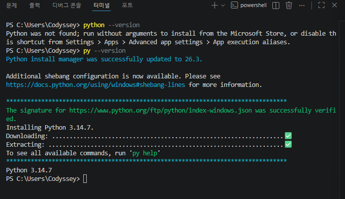

---

## 4-2. Python 기본 실행 확인

`hello.py` 파일을 생성하고 다음 코드를 작성했습니다.

```python
print("Hello")
```

터미널에서 다음 명령어로 실행했습니다.

```bash
py hello.py
```

실행 결과:

```text
Hello
```

가 정상적으로 출력되는 것을 확인했습니다.

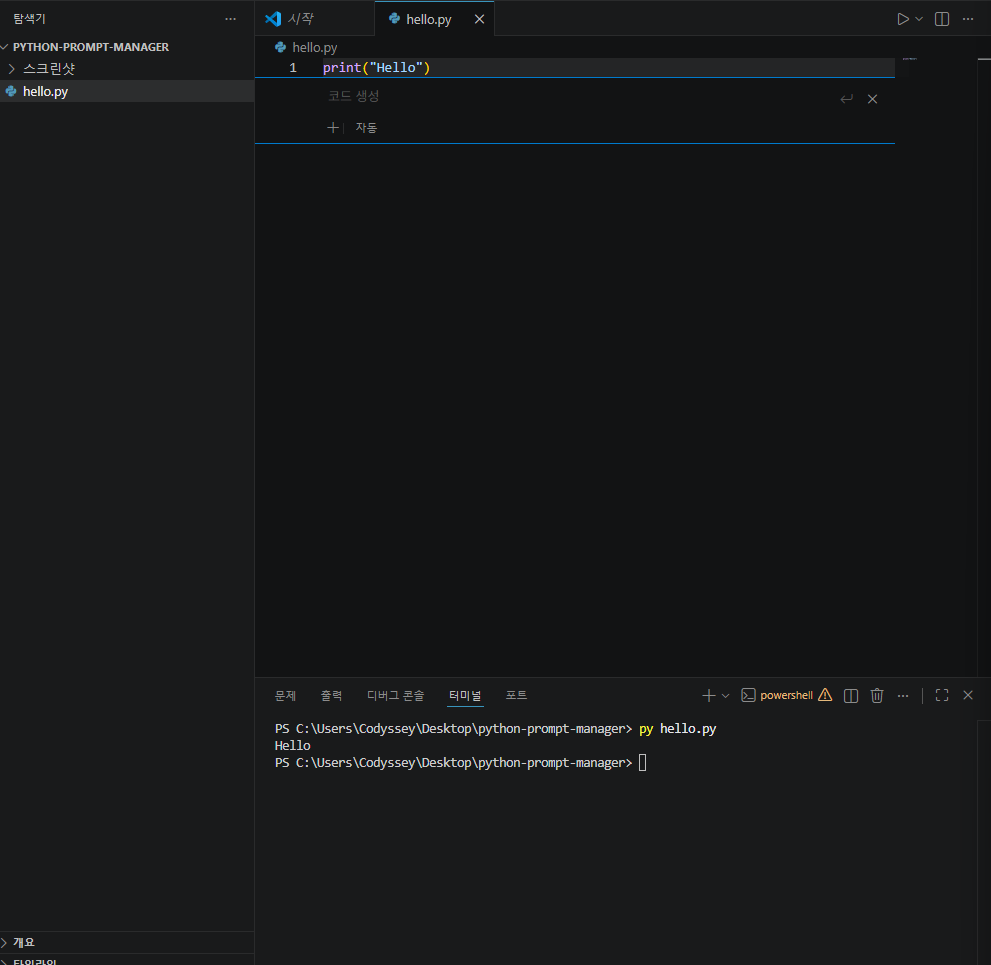

---

# 5. Git 개발 환경 확인

## 5-1. Git 버전 확인

다음 명령어를 실행했습니다.

```bash
git --version
```

사용한 Git 버전:

```text
git version 2.55.0.windows.3
```

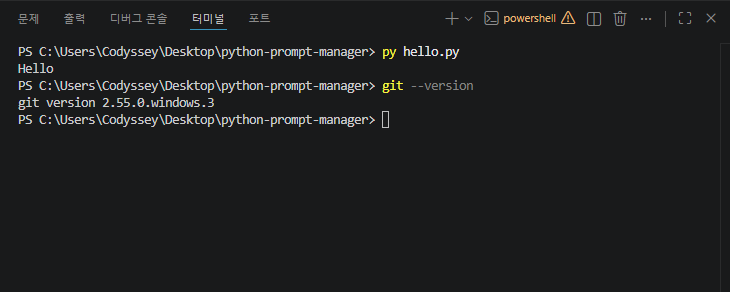

---

## 5-2. Git 사용자 정보 및 기본 브랜치 설정

다음 설정을 진행했습니다.

```bash
git config --global user.name
git config --global user.email
git config --global init.defaultBranch main
```

기본 브랜치 이름은 `main`으로 설정했습니다.

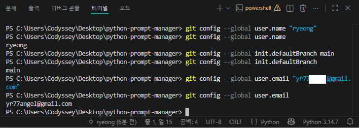

---

# 6. Git 저장소 초기화

프로젝트 폴더에서 다음 명령어를 실행했습니다.

```bash
git init
```

변경된 파일을 Git 관리 대상으로 추가했습니다.

```bash
git add .
```

첫 번째 커밋을 생성했습니다.

```bash
git commit -m "chore: initialize project"
```

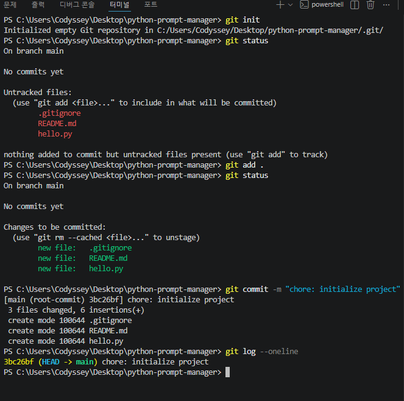

---

# 7. GitHub 원격 저장소 연결

GitHub에 `python-prompt-manager` 저장소를 생성한 뒤 로컬 프로젝트와 연결했습니다.

```bash
git remote add origin https://github.com/ll-0l/python-prompt-manager.git
```

연결 확인:

```bash
git remote -v
```

처음으로 GitHub에 업로드:

```bash
git push -u origin main
```

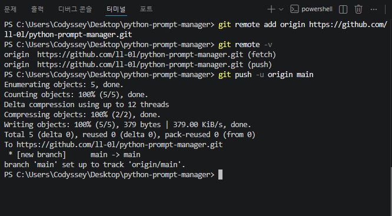

GitHub에서 실제 프로젝트 파일이 업로드된 것을 확인했습니다.

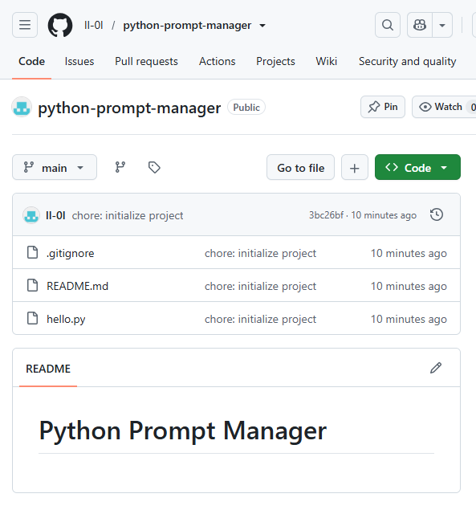

---

# 8. 프로그램 메인 메뉴

프로그램 실행 시 다음 메뉴가 출력됩니다.

```text
=== 나만의 프롬프트 관리 ===
1. 프롬프트 추가
2. 프롬프트 목록
3. 카테고리별 조회
4. 프롬프트 검색
5. 프롬프트 상세 보기
6. 즐겨찾기 관리
7. 즐겨찾기 목록
0. 종료
선택:
```

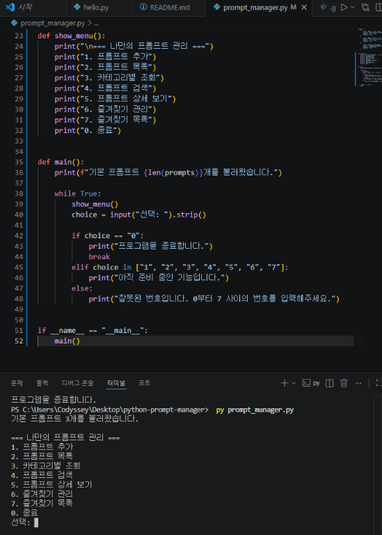

사용자가 존재하지 않는 번호를 입력한 경우 오류 안내를 출력하고 다시 메뉴를 보여줍니다.

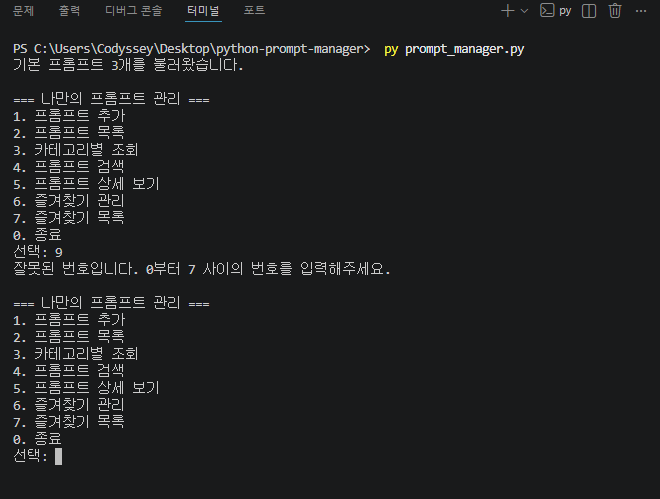

---

# 9. 프롬프트 추가

메뉴에서 `1`을 선택하면 새로운 프롬프트를 등록할 수 있습니다.

입력 항목:

* 제목
* 내용
* 카테고리

제목이나 내용을 비워두면 다시 입력하도록 처리했습니다.

카테고리는 다음 기본 목록에서 선택할 수 있습니다.

```text
1) 텍스트 생성
2) 이미지 생성
3) 영상 생성
4) 페르소나
5) 자동화
6) 기타
7) 직접 입력
```

새로운 프롬프트는 다음 구조로 생성됩니다.

```python
new_prompt = {
    "title": title,
    "content": content,
    "category": category,
    "favorite": False
}
```

리스트에 추가:

```python
prompts.append(new_prompt)
```

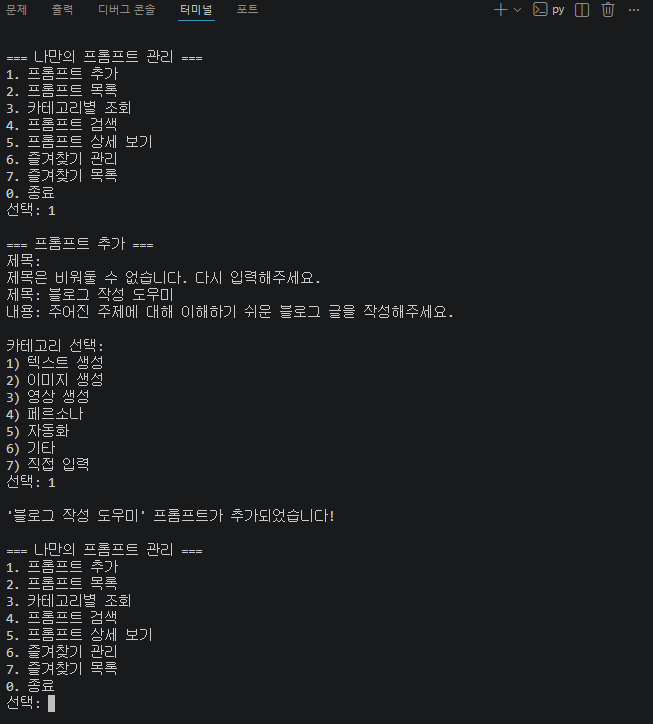

---

# 10. 프롬프트 목록

메뉴에서 `2`를 선택하면 저장된 모든 프롬프트를 출력합니다.

각 항목에는 다음 정보가 표시됩니다.

* 번호
* 카테고리
* 제목
* 즐겨찾기 여부 ⭐

프로그램 실행 중 추가한 프롬프트 역시 목록에서 유지되는 것을 확인했습니다.

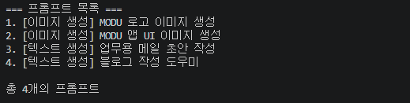

---

# 11. 카테고리별 조회

메뉴에서 `3`을 선택하면 카테고리 목록을 보여줍니다.

사용자가 선택한 카테고리와 일치하는 프롬프트만 필터링합니다.

핵심 조건:

```python
prompt["category"] == selected_category
```

해당 카테고리에 등록된 프롬프트가 없으면:

```text
해당 카테고리에 등록된 프롬프트가 없습니다.
```

라고 안내합니다.

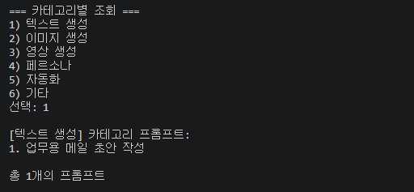

---

# 12. 프롬프트 검색

메뉴에서 `4`를 선택하면 키워드로 프롬프트를 검색합니다.

검색 대상:

* 제목
* 내용

핵심 검색 로직:

```python
keyword.lower() in prompt["title"].lower()
```

또는:

```python
keyword.lower() in prompt["content"].lower()
```

따라서 **부분 문자열 검색** 방식입니다.

영문 문자열에는 `lower()`를 사용하여 대소문자의 영향을 줄였습니다.

예를 들어:

```text
MODU
modu
Modu
```

와 같은 입력을 동일한 방식으로 비교할 수 있습니다.

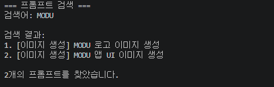

## 검색 방식의 한계

현재 버전에서는 다음 기능은 지원하지 않습니다.

* 정규표현식 검색
* 정확 일치 전용 검색
* 검색 관련도 순위
* AND / OR 복합 검색

향후 정확 검색과 부분 검색을 선택할 수 있도록 확장할 수 있습니다.

---

# 13. 프롬프트 상세 보기

메뉴에서 `5`를 선택하고 프롬프트 번호를 입력하면 다음 내용을 출력합니다.

* 제목
* 카테고리
* 즐겨찾기 여부
* 전체 프롬프트 내용

숫자가 아닌 값을 입력하거나 존재하지 않는 번호를 선택하면 안내 메시지를 출력합니다.

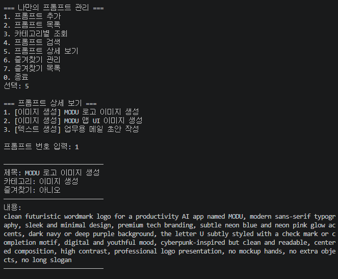

---

# 14. 즐겨찾기 관리

메뉴에서 `6`을 선택하여 즐겨찾기를 추가하거나 해제할 수 있습니다.

핵심 코드는 다음과 같습니다.

```python
prompt["favorite"] = not prompt["favorite"]
```

즉:

```text
False → True
```

또는 다시 선택하면:

```text
True → False
```

로 변경됩니다.

즐겨찾기된 항목은 목록에서 ⭐로 표시됩니다.

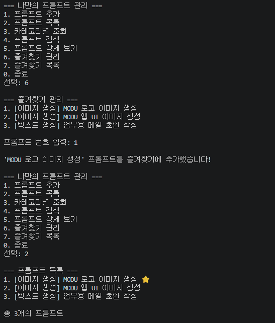

---

# 15. 즐겨찾기 목록

메뉴에서 `7`을 선택하면 다음 조건을 만족하는 프롬프트만 출력합니다.

```python
prompt["favorite"]
```

즉 `favorite`이 `True`인 데이터만 필터링합니다.

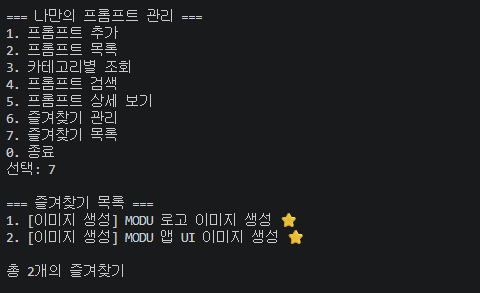

즐겨찾기가 없는 경우:

```text
즐겨찾기된 프롬프트가 없습니다.
```

라고 안내합니다.

---

# 16. 기본 프롬프트 데이터

프로그램 시작 시 이전 생성형 AI 미션에서 사용한 프롬프트 3개를 기본 데이터로 등록했습니다.

## 기본 프롬프트 1

제목:

```text
MODU 로고 이미지 생성
```

카테고리:

```text
이미지 생성
```

---

## 기본 프롬프트 2

제목:

```text
MODU 앱 UI 이미지 생성
```

카테고리:

```text
이미지 생성
```

---

## 기본 프롬프트 3

제목:

```text
업무용 메일 초안 작성
```

카테고리:

```text
텍스트 생성
```

총 **3개의 기본 프롬프트**가 프로그램 시작 시 자동 등록됩니다.

---

# 17. 데이터 구조

프로그램의 프롬프트 데이터는 **리스트 안에 딕셔너리를 저장하는 구조**로 구성했습니다.

예시:

```python
prompts = [
    {
        "title": "MODU 로고 이미지 생성",
        "content": "프롬프트 내용",
        "category": "이미지 생성",
        "favorite": False
    }
]
```

---

## 17-1. 데이터 스키마

| 필드         | 자료형    | 필수 여부 | 설명        |
| ---------- | ------ | ----- | --------- |
| `title`    | `str`  | 필수    | 프롬프트 제목   |
| `content`  | `str`  | 필수    | 프롬프트 내용   |
| `category` | `str`  | 필수    | 프롬프트 카테고리 |
| `favorite` | `bool` | 필수    | 즐겨찾기 상태   |

제목과 내용, 카테고리는 빈 값을 허용하지 않습니다.

즐겨찾기의 기본값은:

```python
False
```

입니다.

---

# 18. 리스트와 딕셔너리를 선택한 이유

## 리스트를 선택한 이유

여러 프롬프트를 **등록된 순서대로 저장하고 출력하기 쉽기 때문**에 리스트를 사용했습니다.

새 데이터를 추가할 때:

```python
prompts.append(new_prompt)
```

처럼 간단하게 처리할 수 있습니다.

### 리스트의 장점

* 입력된 순서를 유지하기 쉬움
* 반복문으로 전체 데이터를 조회하기 쉬움
* `append()`를 이용한 데이터 추가가 단순함
* 이번 과제처럼 데이터 규모가 작은 프로그램에서 구조를 이해하기 쉬움

### 리스트의 단점

검색이나 중복 검사를 할 때 데이터를 처음부터 순차적으로 확인해야 합니다.

따라서 데이터가 수천 개 이상으로 증가하면 검색 시간이 증가할 수 있습니다.

---

## 딕셔너리를 선택한 이유

프롬프트 하나에는 제목, 내용, 카테고리, 즐겨찾기처럼 서로 다른 의미를 가진 값들이 있습니다.

딕셔너리를 사용하면 다음과 같이 이름으로 접근할 수 있습니다.

```python
prompt["title"]
prompt["content"]
prompt["category"]
prompt["favorite"]
```

### 딕셔너리의 장점

* 각 값의 의미가 명확함
* 코드의 가독성이 높음
* 새로운 속성을 추가하기 쉬움

### 딕셔너리의 한계

데이터 구조가 복잡해지면 필드 이름과 데이터 형식을 일관되게 관리해야 합니다.

현재 과제에서는 데이터 규모가 작고 Python 기본 자료구조 학습이 목적이므로 **리스트 + 딕셔너리 구조**를 선택했습니다.

데이터 규모가 커질 경우 고유 ID와 데이터베이스를 사용하는 방법이 더 적합할 수 있습니다.

---

# 19. 중복 제목 처리 규칙

기존 버전에서는 같은 제목의 프롬프트를 여러 번 등록할 경우 별도의 충돌 처리 규칙이 없었습니다.

사전평가 결과를 반영하여 **중복 제목 자동 번호 처리 기능**을 추가했습니다.

이미 다음 제목이 존재할 경우:

```text
MODU 로고 이미지 생성
```

같은 제목을 다시 등록하면:

```text
MODU 로고 이미지 생성 (2)
```

로 저장됩니다.

또 다시 같은 제목을 등록하면:

```text
MODU 로고 이미지 생성 (3)
```

과 같이 번호가 증가합니다.

이를 통해 기존 프롬프트를 덮어쓰지 않고 새로운 데이터를 별도로 보존할 수 있습니다.

목록과 상세 보기에서는 번호도 함께 사용하므로 같은 이름의 프롬프트가 존재하더라도 각각 개별적으로 선택할 수 있습니다.

---

# 20. 카테고리 충돌 처리 규칙

사용자가 프롬프트 추가 과정에서 `직접 입력`을 선택할 수 있습니다.

직접 입력한 이름이 기존 카테고리와 같은 경우 중복된 카테고리를 새로 생성하지 않고 **기존 카테고리를 재사용**하도록 처리했습니다.

예:

기존 카테고리:

```text
이미지 생성
```

사용자가 직접 다시:

```text
이미지 생성
```

을 입력하면 기존 카테고리를 사용합니다.

영문 카테고리 이름의 경우 다음처럼 대소문자가 달라도 비교할 수 있도록 `lower()`를 사용합니다.

```text
Image
image
IMAGE
```

앞뒤 공백은 `strip()`을 이용하여 제거합니다.

---

# 21. 데이터 영속화 설계

현재 필수 과제에서는 프로그램 실행 중에만 데이터를 유지합니다.

현재 흐름:

```text
프로그램 실행
↓
기본 프롬프트 3개 생성
↓
prompts 리스트에서 관리
↓
프롬프트 추가
↓
즐겨찾기 변경
↓
프로그램 실행 중 상태 유지
↓
프로그램 종료
↓
초기화
```

이 방식은 과제 필수 요구사항인:

> 프로그램 실행 중에 추가한 프롬프트와 즐겨찾기 상태가 유지되고 종료 시 초기화

조건에 맞춘 의도적인 설계입니다.

---

## 21-1. 향후 JSON 영속화 방식

프로그램 종료 후에도 데이터를 유지하도록 확장할 경우 Python 기본 라이브러리 `json`을 사용할 수 있습니다.

예상 파일:

```text
prompts.json
```

예상 데이터:

```json
[
    {
        "title": "MODU 로고 이미지 생성",
        "content": "프롬프트 내용",
        "category": "이미지 생성",
        "favorite": true
    }
]
```

예상 처리 흐름:

```text
프로그램 실행
↓
prompts.json 존재 확인
↓
JSON 파일 읽기
↓
prompts 리스트 생성
↓
프롬프트 추가 / 수정 / 즐겨찾기 변경
↓
prompts.json 저장
↓
프로그램 종료
↓
다음 실행 시 기존 데이터 복원
```

JSON을 우선 고려하는 이유는 현재 사용하는 **리스트와 딕셔너리 구조를 자연스럽게 표현할 수 있고 외부 라이브러리가 필요하지 않기 때문**입니다.

데이터 규모가 커지면 JSON 대신 SQLite 데이터베이스를 사용하는 방안도 고려할 수 있습니다.

---

# 22. 입력 검증

사용자가 잘못된 값을 입력해도 프로그램이 중단되지 않도록 입력 검증을 적용했습니다.

처리하는 상황:

* 메인 메뉴에서 존재하지 않는 번호 입력
* 제목 빈 입력
* 내용 빈 입력
* 카테고리 빈 입력
* 카테고리 잘못된 번호
* 검색어 빈 입력
* 검색 결과 없음
* 상세 보기에서 숫자가 아닌 값 입력
* 존재하지 않는 상세 보기 번호
* 즐겨찾기에서 숫자가 아닌 값 입력
* 존재하지 않는 즐겨찾기 번호

예:

```python
if not number.isdigit():
    print("잘못된 입력입니다. 번호를 입력해주세요.")
    return
```


현재는 각 함수가 직접 입력값을 검사합니다.

프로그램 규모가 커진다면 다음과 같은 공통 함수를 만들어 중복된 입력 검증 코드를 줄일 수 있습니다.

```text
get_non_empty_input()
get_valid_number()
```

---

# 23. 메인 반복문 설계

프로그램이 기능 하나를 실행한 뒤 바로 종료되지 않고 다시 메뉴를 보여줄 수 있도록 `while True`를 사용했습니다.

```python
while True:
    show_menu()
    choice = input("선택: ").strip()
```

사용자가 `0`을 입력하면:

```python
if choice == "0":
    print("프로그램을 종료합니다.")
    break
```

가 실행됩니다.

따라서 사용자가 직접 종료를 선택하기 전까지 반복적으로 사용할 수 있는 **대화형 콘솔 프로그램 구조**입니다.

---

# 24. 함수 구조

모든 코드를 하나의 함수에 몰아넣지 않고 기능별로 분리했습니다.

| 함수                     | 역할         | 주요 예외 처리             |
| ---------------------- | ---------- | -------------------- |
| `add_prompt()`         | 프롬프트 추가    | 빈 입력, 중복 제목, 카테고리 충돌 |
| `show_prompt_list()`   | 전체 목록 출력   | 데이터 없음               |
| `show_by_category()`   | 카테고리 조회    | 문자 입력, 범위 오류, 결과 없음  |
| `search_prompt()`      | 키워드 검색     | 빈 검색어, 검색 결과 없음      |
| `show_prompt_detail()` | 상세 보기      | 문자 입력, 잘못된 번호        |
| `toggle_favorite()`    | 즐겨찾기 추가·해제 | 문자 입력, 잘못된 번호        |
| `show_favorites()`     | 즐겨찾기 목록    | 즐겨찾기 없음              |
| `show_menu()`          | 메인 메뉴 출력   | 없음                   |
| `main()`               | 프로그램 실행 흐름 | 메뉴 오류 및 종료           |

---

# 25. Git Branch 활용

과제 요구사항에 따라 프롬프트 목록 기능은 `main`에서 바로 개발하지 않고 별도 브랜치를 생성했습니다.

브랜치 이름:

```text
feature/prompt-list
```

브랜치 생성 및 이동:

```bash
git checkout -b feature/prompt-list
```

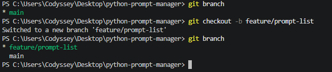

해당 브랜치에서 프롬프트 목록 기능을 구현하고 다음 커밋을 생성했습니다.

```text
feat: add prompt list
```

기능 구현 후 다시 `main`으로 이동했습니다.

```bash
git checkout main
```

그리고 다음 명령어로 병합했습니다.

```bash
git merge --no-ff feature/prompt-list -m "merge: add prompt list feature"
```

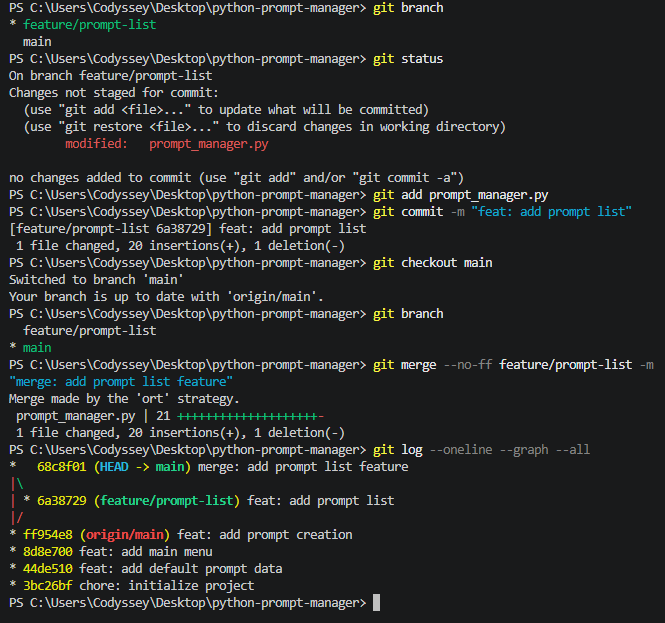

---

## 브랜치를 분리한 이유

새로운 기능 개발 중 발생할 수 있는 오류가 안정적인 `main` 코드에 바로 영향을 주지 않도록 분리하기 위해 브랜치를 사용했습니다.

작업 기준:

```text
새로운 독립 기능
↓
feature 브랜치 생성
↓
기능 개발
↓
테스트
↓
기능 단위 commit
↓
main으로 이동
↓
merge
```

이번 프로젝트에서는 과제 요구사항에 따라 프롬프트 목록 기능을 독립 작업 대상으로 선택했습니다.

---

# 26. Git Clone 실습

공개 GitHub 저장소를 실제로 내려받았습니다.

사용한 저장소:

```text
octocat/Hello-World
```

명령어:

```bash
git clone https://github.com/octocat/Hello-World.git
```

터미널 출력에서:

```text
Cloning into 'Hello-World'...
```

메시지를 확인했습니다.

이후 폴더로 이동했습니다.

```bash
cd Hello-World
```

폴더 구조 확인:

```bash
dir
```

Git 로그 확인:

```bash
git log --oneline --graph --all
```

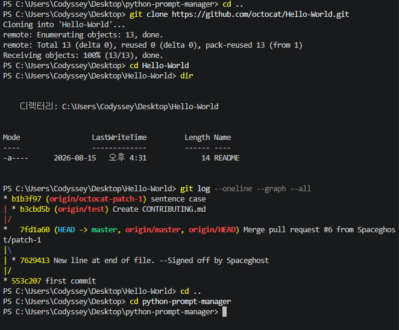

확인이 끝난 뒤 원래 프로젝트로 돌아왔습니다.

---

# 27. 사용한 Git 명령어

이번 프로젝트에서 과제에서 요구한 Git 명령어를 모두 실제로 사용했습니다.

## git init

```bash
git init
```

새 로컬 Git 저장소를 시작합니다.

## git add

```bash
git add prompt_manager.py
```

변경사항을 다음 커밋에 포함할 준비를 합니다.

## git commit

예:

```bash
git commit -m "feat: add prompt search"
```

변경사항을 하나의 버전으로 기록합니다.

## git push

```bash
git push origin main
```

로컬의 커밋을 GitHub에 업로드합니다.

## git pull

```bash
git pull origin main
```

원격 저장소의 최신 변경사항을 로컬로 가져옵니다.

## git checkout

```bash
git checkout -b feature/prompt-list
git checkout main
```

새로운 브랜치를 생성하거나 다른 브랜치로 이동합니다.

## git clone

```bash
git clone https://github.com/octocat/Hello-World.git
```

공개 GitHub 저장소를 로컬 컴퓨터로 복제합니다.

## git merge

```bash
git merge --no-ff feature/prompt-list -m "merge: add prompt list feature"
```

별도 브랜치에서 개발한 기능을 `main`에 병합합니다.

### Git 명령어 사용 결과

* `git init` ✅
* `git add` ✅
* `git commit` ✅
* `git push` ✅
* `git pull` ✅
* `git checkout` ✅
* `git clone` ✅
* `git merge` ✅

---

# 28. Commit 관리

프로젝트는 기능 단위로 커밋했습니다.

주요 커밋:

```text
chore: initialize project
feat: add default prompt data
feat: add main menu
feat: add prompt creation
feat: add prompt list
merge: add prompt list feature
feat: add category filter
feat: add prompt search
feat: add prompt detail view
feat: add favorite toggle
feat: add favorite list
docs: complete README
docs: add project screenshots
fix: handle duplicate prompt conflicts
docs: address design feedback in README
```

10개 이상의 의미 있는 커밋 요구사항을 충족했습니다.

최종 Git 로그 확인 명령:

```bash
git log --oneline --graph --all
```

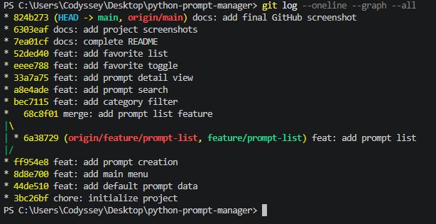

---

# 29. GitHub 최종 상태

프로젝트 코드, README, 최종 제출 문서 및 개발 증빙 파일을 GitHub에 업로드했습니다.

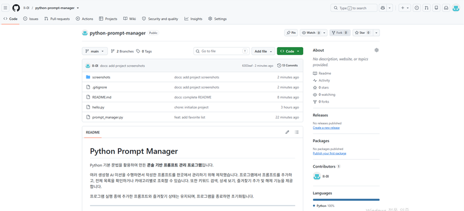

프로젝트 주요 구조:

```text
python-prompt-manager/
│
├── screenshots/
├── .gitignore
├── README.md
├── SUBMISSION.md
├── hello.py
└── prompt_manager.py
```

---

# 30. 사전평가 보완 사항

AI 사전평가 결과에서 보완이 필요하다고 판단된 항목을 수정했습니다.

## 평가 항목 #16 보완

### 기존 부족사항

리스트와 딕셔너리를 사용했다는 사실만 설명하고 선택 이유와 장단점을 설명하지 않았습니다.

### 보완 내용

* 리스트를 사용한 이유
* 딕셔너리를 사용한 이유
* 각각의 장점
* 각각의 한계
* 데이터 증가 시 성능 문제
* 향후 데이터베이스 확장 가능성

을 README와 본 제출 문서에 추가했습니다.

---

## 평가 항목 #20 보완

### 기존 부족사항

프로그램 종료 후 데이터를 어떻게 보존할지에 대한 영속화 설계가 없었습니다.

### 보완 내용

현재 메모리 기반 저장이 필수 요구사항에 따른 의도적인 구현임을 명시했습니다.

추가로 향후:

```text
prompts.json
```

파일을 활용한 JSON 저장·불러오기 구조를 설계했습니다.

데이터 규모가 커지는 경우 SQLite로 확장하는 방안도 제시했습니다.

---

## 평가 항목 #21 보완

### 기존 부족사항

동일한 제목의 프롬프트 또는 같은 카테고리 이름 입력 시 처리 규칙이 없었습니다.

### 보완 내용

프롬프트 제목이 중복되면:

```text
제목
제목 (2)
제목 (3)
```

방식으로 자동 번호를 추가하도록 코드를 수정했습니다.

또한 직접 입력한 카테고리가 기존 카테고리와 동일하면 새로운 중복 카테고리를 만들지 않고 기존 카테고리를 재사용하도록 수정했습니다.

---

# 31. 그 외 사전평가 의견 반영

FAIL 항목 외에도 PASS 항목의 보완 의견을 참고하여 다음 내용을 추가했습니다.

* Python 버전 확인 명령어 명시
* Git 버전 확인 명령어 명시
* GitHub 업로드 증빙
* Clone 실행 명령 텍스트
* 검색 방식 설명
* 검색 방식의 한계
* 각 함수 역할 설명
* 데이터 스키마와 자료형 설명
* 입력 검증 방식 설명
* 향후 공통 입력 검증 함수 제안
* 메인 `while True` 반복 구조의 의도
* 브랜치 분리 및 병합 기준
* 주요 Commit 목록
* Git Log 확인 명령
* 향후 프로젝트 확장 방향

---

# 32. 필수 요구사항 체크리스트

## 개발 환경

* [x] VSCode 사용
* [x] Python 확장 사용
* [x] Python 3.10 이상
* [x] Python 버전 확인
* [x] `print("Hello")` 실행
* [x] Git 버전 확인
* [x] Git 사용자 이름 설정
* [x] Git 이메일 설정
* [x] 기본 브랜치 `main` 설정
* [x] GitHub 저장소 생성 및 연결

---

## 프로그램

* [x] 콘솔 기반 메뉴
* [x] 번호 입력 기능
* [x] 잘못된 메뉴 입력 처리
* [x] 종료 기능
* [x] 기본 프롬프트 3개 이상
* [x] 리스트 사용
* [x] 딕셔너리 사용
* [x] 제목 필드
* [x] 내용 필드
* [x] 카테고리 필드
* [x] 즐겨찾기 필드
* [x] 프롬프트 추가
* [x] 빈 제목 검사
* [x] 빈 내용 검사
* [x] 기본 카테고리 선택
* [x] 직접 카테고리 입력
* [x] 전체 프롬프트 목록
* [x] 카테고리별 조회
* [x] 검색
* [x] 제목 검색
* [x] 내용 검색
* [x] 검색 결과 없음 처리
* [x] 상세 보기
* [x] 상세 보기 번호 검증
* [x] 즐겨찾기 추가
* [x] 즐겨찾기 해제
* [x] 즐겨찾기 목록
* [x] 기능별 함수 분리
* [x] 실행 중 데이터 유지
* [x] 종료 시 기본 상태 초기화
* [x] 중복 제목 처리
* [x] 카테고리 충돌 처리

---

## Git / GitHub

* [x] `git init`
* [x] `git add`
* [x] `git commit`
* [x] `git push`
* [x] `git pull`
* [x] `git checkout`
* [x] `git clone`
* [x] `git merge`
* [x] `.gitignore`
* [x] GitHub Public Repository
* [x] 10개 이상 의미 있는 Commit
* [x] 추가 Branch 생성
* [x] `feature/prompt-list` 사용
* [x] Branch에서 목록 기능 구현
* [x] `main`으로 Merge
* [x] `git log --oneline --graph --all` 확인

---

## 제출 자료

* [x] GitHub Repository URL
* [x] Python 버전 증빙
* [x] Hello 실행 증빙
* [x] Git 버전 증빙
* [x] Git 설정 증빙
* [x] GitHub Push 증빙
* [x] 메인 메뉴 실행 결과
* [x] 잘못된 입력 결과
* [x] 프롬프트 추가 결과
* [x] 프롬프트 목록 결과
* [x] 카테고리별 조회 결과
* [x] 검색 결과
* [x] 상세 보기 결과
* [x] 즐겨찾기 결과
* [x] 즐겨찾기 목록 결과
* [x] Branch 생성 증빙
* [x] Merge 증빙
* [x] Clone 증빙
* [x] Git Log 증빙
* [x] README.md
* [x] SUBMISSION.md

---

# 33. 향후 개선 방향

현재 프로그램은 Python 기초 문법과 Git/GitHub 학습을 목적으로 만든 콘솔 프로그램입니다.

향후 실제 프롬프트 관리 서비스로 발전시킨다면 다음 기능을 추가할 수 있습니다.

* JSON 영구 저장
* SQLite 데이터베이스
* 프롬프트 수정
* 프롬프트 삭제
* 고유 ID
* 프롬프트 조회수
* 조회수 Top 목록
* 태그 기능
* 정렬
* 정확 검색
* 부분 검색 선택
* 복합 검색
* 공통 입력 검증 함수
* GUI
* 웹 기반 관리 화면

---

# 34. 프로젝트 회고

이번 프로젝트를 시작하기 전에는 Python 프로그램을 직접 만들고 Git으로 버전 관리를 진행하는 과정이 익숙하지 않았습니다.

먼저 `print("Hello")`를 실행하면서 Python 파일 작성과 실행 방식을 확인했습니다.

이후 리스트와 딕셔너리를 사용하여 기본 프롬프트 데이터를 구성하고, 조건문과 반복문을 이용해 메뉴가 계속 실행되는 구조를 구현했습니다.

각 기능을 별도의 함수로 나누면서 하나의 프로그램이 여러 기능의 조합으로 구성된다는 점을 확인할 수 있었습니다.

Git에서는 기능을 하나씩 완성할 때마다 Commit을 생성했습니다.

특히 `feature/prompt-list` 브랜치를 별도로 만들어 프롬프트 목록 기능을 구현하고 `main` 브랜치에 Merge하면서 브랜치 기반 개발 흐름도 직접 수행했습니다.

또한 `push`, `pull`, `clone` 등을 사용하면서 로컬 저장소와 GitHub 원격 저장소가 서로 다른 공간이며 Git 명령을 통해 변경사항을 주고받는다는 것을 이해할 수 있었습니다.

사전평가 이후에는 단순히 프로그램이 동작하는 것뿐만 아니라 **왜 리스트와 딕셔너리를 선택했는지, 데이터가 많아졌을 때 어떤 문제가 생길 수 있는지, 프로그램 종료 이후 데이터를 어떻게 저장할 수 있는지, 중복 데이터가 발생했을 때 어떤 규칙으로 처리해야 하는지**까지 추가로 고민했습니다.

이를 통해 프로그램 구현뿐만 아니라 데이터 구조 선택, 충돌 규칙, 확장 설계와 같은 소프트웨어 설계 관점도 함께 학습할 수 있었습니다.

---

# 35. 최종 제출 정보

**프로젝트명:** Python Prompt Manager

**GitHub Repository:**
https://github.com/ll-0l/python-prompt-manager

**최종 제출 파일:**
`SUBMISSION.md`
